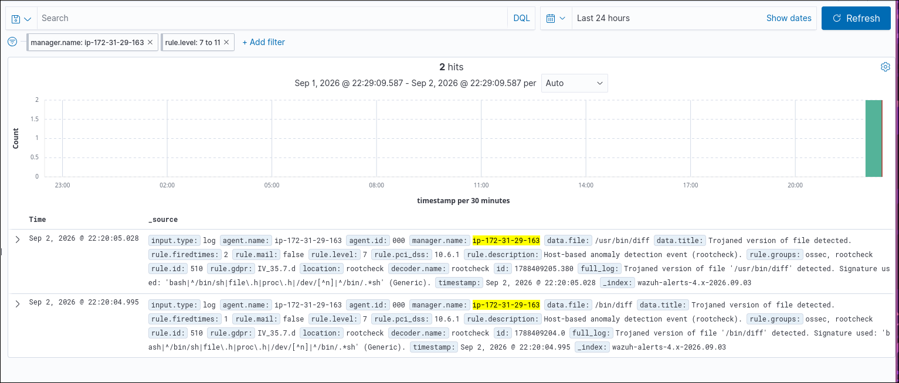

# 🔍 [Reporte Técnico] Detección de Falso Positivo: Rule ID 510 (Rootcheck) en binario `/usr/bin/diff`


-orange?style=for-the-badge)


## 1. Resumen Ejecutivo y Metadatos
* **Fecha/Hora del Incidente:** 02/09/2026 @ 22:20:05.028 UTC
* **Analista Asignado:** SOC Analyst L1
* **Host Afectado:** `ip-172-31-29-163` (Agent ID: `000` / Manager Server)
* **Regla Disparada:** `Rule ID: 510` — *Host-based anomaly detection event (rootcheck)*
* **Veredicto Preliminar:** **Falso Positivo (False Positive)**
* **Acción de Mitigación Realizada:** Regla afinada (*Rule Tuning*) suprimiendo el path en `ossec.conf`.

---

## 2. Descripción de la Alerta

Durante la monitorización de telemetría y eventos del sistema del Wazuh Server, el motor de detección de anomalías locales (**Rootcheck**) generó dos alertas consecutivas de severidad 7 catalogadas bajo cumplimiento normativo PCI-DSS 10.6.1 y GDPR IV_35.7.d:

* **Alerta 1:** `data.file: /bin/diff` — `Trojaned version of file '/bin/diff' detected`
* **Alerta 2:** `data.file: /usr/bin/diff` — `Trojaned version of file '/usr/bin/diff' detected`



## 3. Análisis de Causa Raíz

El componente Rootcheck compara los ejecutables escenciales del sistema contra una lista de firmas estáticas predifinidas dentro de `rootkit_trojans.txt` 
esto con el objetivo de verificar que los binarios legítimos no han sido reemplazados por rootkits o troyanos. 


**Origen del Conflicto**

La regla que causa el conflicto en este caso es: 

_"Si el binario diff contiene una referencia a un dispositivo en /dev/ que no sea /dev/null, trátalo como sospechoso y emite una alerta de troyano"._

En versiones modernas del paquete de utilidaddes GNU presente en Ubuntu o Debian se añadió soporte oficial para manejar el dispositivo `/dev/full`.
Cuando estas versiones nuevas de `diff` son compiladas, la palabra `/dev/full` se graba dentro del binario de la herramienta, en el momento que **Wazuh** escanea el binario de diff ocurre lo siguiente: 

* Encuentra el texto `/dev/full`.
* La regla antigua solo esperaba ver `/dev/null`. 
* El algoritmo asume **erróneamente** que un atacante modificó la herramienta. 
* Se dispara la alerta "Trojaned version of file".

## 4. Metodología de Triaje e Investigación Forense

Para validar si se trataba de una intrusión real o un falso positivo, se procedió con una verificación forense: 

### Fase 1: Verificar integridad contra el repositorio de paquetes
Se empleó el verificador del gestor de paquetes de Ubuntu `dpkg` de esta manera comparamos la estructura del binario con la firma original del desarrollador: 


El comando no arrojó discrepancias de salida, lo que confirma que la herramienta no ha sido alterada. 
A su vez se comprobó el propietario del archivo con el comando `dpkg -S /usr/bin/diff`

## 5. Acciones de Contención y Afinamiento. 
Habiendo descartado compromiso o persistencia de adversarios, se aplicó un procedimiento de Rule Tuning para evitar la saturación de eventos no accionables en la base de datos de OpenSearch/Indexer:

### 1. Edición del archivo de configuración del Manager: 

```bash
  sudo nano /var/ossec/etc/ossec.conf
```

### 2. Inclusión de excepciones en la directiva <rootcheck>:

```xml
<rootcheck>
  <disabled>no</disabled>
  <check_files>yes</check_files>
  <check_trojans>yes</check_trojans>
  <check_dev>yes</check_dev>
  <check_sys>yes</check_sys>
  <check_pids>yes</check_pids>
  <check_ports>yes</check_ports>
  <check_interfaces>yes</check_interfaces>

  <!-- Supresión de falsos positivos en binarios verificados por dpkg -->
  <ignore>/usr/bin/diff</ignore>
  <ignore>/bin/diff</ignore>
</rootcheck>
```

### 3. Reinicio de servicios: 

```bash
  sudo systemctl restart wazuh-manager
```

## 6. Lecciones Aprendidas

* Gestión de Falsos Positivos en SOC: 
No toda alerta de severidad media/alta representa una brecha. El análisis estático por cadenas en binarios (strings) es propenso a colisiones accidentales con software actualizado.

* Uso de Verificadores del Sistema: 
Herramientas nativas como dpkg -V (en Debian/Ubuntu) o rpm -V (en RHEL/CentOS) son el mecanismo primario para validar la integridad de un binario antes de ejecutar acciones de contención disruptivas.

* Optimización de Reglas (Tuning):
El afinamiento continuo mediante directivas <ignore> o reglas hijas condicionales es fundamental para mantener dashboards limpios y evitar la fatiga de alertas.
