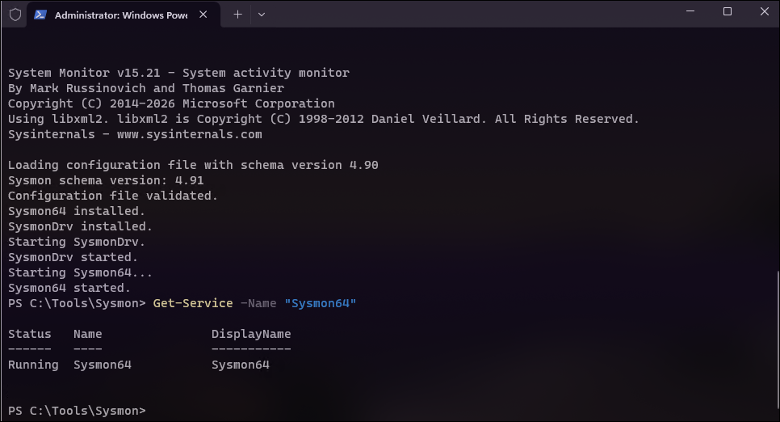
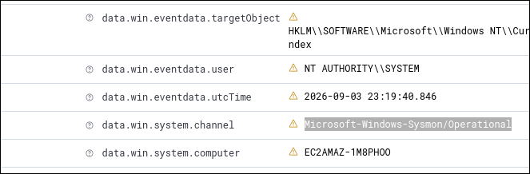

# 👾 [Write-up] Día 2: Despliegue de Agentes Endpoint y Enriquecimiento con Sysmon


## 1. Resumen Ejecutivo y Metadatos
* **Fecha:** 08/09/2026
* **Rol:** SOC Analyst L1 / Cloud Security Engineer
* **Entorno:** AWS Cloud (VPC Privada)
* **Objetivo:** Extender la visibilidad del SIEM/XDR mediante la instalación del Agente de Wazuh en dos *endpoints* víctimas (Windows Server y Ubuntu Linux). Asimismo, se enriqueció la telemetría del sistema operativo integrando **Sysmon** (en Windows) y **Sysmon for Linux** para capturar eventos detallados de nivel de kernel (creación de procesos, conexiones de red y modificaciones).

---

## 2. Especificaciones de Infraestructura Desplegada

| Componente | Tipo de Instancia | SO / Versión | Rol en el Laboratorio | IP Privada (VPC) |
| :--- | :---: | :--- | :--- | :---: |
| **Wazuh Server** | `t3.medium` | Ubuntu 24.04 LTS | SIEM / Manager / Indexer / Dashboard | `172.31.29.163` |
| **Target Windows** | `t3.medium` | Windows Server 2025 | Endpoint Víctima (Sysmon + Wazuh Agent) | Dinámica (VPC) |
| **Target Linux** | `t3.micro` | Ubuntu Server 24.04 | Endpoint Víctima (Sysmon Linux + Agent) | Dinámica (VPC) |

### Configuración de Red y Grupos de Seguridad (Security Groups)
* **Acceso Inbound para Endpoints:**
  * No se requirió la apertura de puertos de entrada adicionales para los agentes en AWS.
  * La comunicación agente-servidor se realiza mediante conexiones salientes (*Outbound*) hacia la **IP privada del Manager** (`172.31.29.163`) a través de los puertos **TCP 1514** (telemetría) y **TCP 1515** (enrolamiento).
* **Acceso de Administración (RDP / SSH):**
  * **Puerto 3389 (RDP):** Restringido a `My IP` (`/32`) en el Security Group de Windows para prevenir ataques de fuerza bruta automatizados desde internet.

---

## 3. Fundamentos Teóricos: ¿Por qué integrar Sysmon?

Los registros de eventos nativos de Windows (como el *Windows Event Log* estándar) son frecuentemente insuficientes durante un análisis forense o *Threat Hunting*. Un atacante puede ejecutar comandos utilizando binarios legítimos del sistema (*Living off the Land* / LotL) sin activar un evento de auditoría básico.

**System Monitor (Sysmon)** es un servicio de la suite Microsoft Sysinternals que se instala como un controlador del sistema (*kernel driver*) para monitorizar y registrar la actividad en el visor de eventos (`Microsoft-Windows-Sysmon/Operational`). Proporciona una visibilidad crítica mediante Event IDs específicos:
* **Event ID 1:** Creación de procesos (incluye línea de comandos completa, hashes SHA256 y proceso padre).
* **Event ID 3:** Conexiones de red iniciadas por procesos.
* **Event ID 11:** Creación/modificación de archivos en tiempo real.

---

## 4. Metodología de Implementación

### Paso 1: Instalación y Enrolamiento del Agente en Windows
1. Se accedió a la máquina virtual Windows Server mediante una sesión de Escritorio Remoto (RDP) cifrada usando `xfreerdp`:
   ```bash
   xfreerdp /v:<IP_PUBLICA_WIN> /u:Administrator /cert-ignore
   ```
   
2. Desde la interfaz web del Manager de Wazuh, se generó el comando de instalación para Windows apuntando estrictamente a la IP privada fija de la VPC:

    ```Powershell
       Invoke-WebRequest -Uri [https://packages.wazuh.com/4.x/windows/wazuh-agent-4.9.0-1.msi](https://packages.wazuh.com/4.x/windows/wazuh-agent-4.9.0-1.msi) -OutFile ${env:tmp}\wazuh-agent.msi; ${env:tmp}\wazuh-agent.msi /q WAZUH_MANAGER='172.31.29.163' WAZUH_REGISTRATION_SERVER='172.31.29.163'
      NET START WazuhSvc
    ```

### Paso 2: Despliegue de Sysmon en Windows
1. Se descargó el ejecutable de Sysmon (x64) y la plantilla modular de reglas optimizada para SOC (Olaf Hartong):

```Powershell
New-Item -ItemType Directory -Force -Path "C:\Tools" ; Set-Location "C:\Tools"
Invoke-WebRequest -Uri "[https://download.sysinternals.com/files/Sysmon.zip](https://download.sysinternals.com/files/Sysmon.zip)" -OutFile "Sysmon.zip"
Expand-Archive -Path "Sysmon.zip" -DestinationPath "C:\Tools\Sysmon" -Force
Set-Location "C:\Tools\Sysmon"

# Configuración modular
Invoke-WebRequest -Uri "[https://raw.githubusercontent.com/olafhartong/sysmon-modular/master/sysmonconfig.xml](https://raw.githubusercontent.com/olafhartong/sysmon-modular/master/sysmonconfig.xml)" -OutFile "sysmonconfig.xml"

# Instalación del servicio
.\Sysmon64.exe -accepteula -i sysmonconfig.xml
```

2. Configuración de lectura en el Agente de Wazuh (ossec.conf):
Se editó el archivo C:\Program Files (x86)\ossec-agent\ossec.conf agregando el bloque de ingesta para el canal operativo de Sysmon:

```xml
   <localfile>
  <location>Microsoft-Windows-Sysmon/Operational</location>
  <log_format>eventchannel</log_format>
</localfile>
```
3. Reiniciar el servicio local: `Restart-Service -Name Wazuh`

4. Ahora comprobamos que el agente se encuentre activo:
   


### Paso 3: Despliegue del Agente y Sysmon en Linux

1. Conexión vía SSH al endpoint Linux e instalación del agente conectándolo a la IP privada del Manager:

   ```bash
      WAZUH_MANAGER='172.31.29.163' WAZUH_AGENT_GROUP='default' curl -s [https://packages.wazuh.com/4.x/apt/wazuh-agent_4.9.0-1_amd64.deb](https://packages.wazuh.com/4.x/apt/wazuh-agent_4.9.0-1_amd64.deb) -o wazuh-agent.deb && sudo WAZUH_MANAGER='172.31.29.163' dpkg -i ./wazuh-agent.deb
      sudo systemctl daemon-reload
      sudo systemctl enable --now wazuh-agent
   ```
2. Instalación de Sysmon for Linux agregando los repositorios oficiales de Microsoft:

```bash
wget -q [https://packages.microsoft.com/config/ubuntu/$(lsb_release](https://packages.microsoft.com/config/ubuntu/$(lsb_release) -rs)/packages-microsoft-prod.deb -O packages-microsoft-prod.deb
sudo dpkg -i packages-microsoft-prod.deb
sudo apt-get update && sudo apt-get install sysmonforlinux -y

# Carga de regla base e inicio del servicio
wget -O sysmonconfig.xml [https://raw.githubusercontent.com/Sysinternals/SysmonForLinux/main/sysmonconfig.xml](https://raw.githubusercontent.com/Sysinternals/SysmonForLinux/main/sysmonconfig.xml)
sudo sysmon -i sysmonconfig.xml
sudo systemctl enable sysmon
```
---

## 5. Verificación y Validación de Telemetría

Estado de Agentes: En la consola principal de Wazuh Dashboard, se confirmó la presencia de 2 agentes activos (Windows y Linux) reportando estado Active.

Validación de Logs de Sysmon:

* En la pestaña Discover, dentro del índice wazuh-archives-*, se filtró por el agente de Windows agregando el término Microsoft-Windows-Sysmon/Operational.
* Se confirmó la captura en tiempo real de eventos enriquecidos mostrando la ejecución de procesos (win32_process), usuarios de origen y hashes de ejecutables.

  

--- 

## 6. Conclusiones y Lecciones Aprendidas

+ Uso de IP Privada en Arquitecturas Cloud Efímeras: Configurar los agentes apuntando a la IP privada interna de la VPC en lugar de la IP pública evita la pérdida de conectividad cuando las instancias se detienen (Stop) y reinician con nuevas direcciones públicas dinámicas.

+ Granularidad de Visibilidad: La integración de Sysmon transforma los logs genéricos del sistema operativo en telemetría de contexto forense directo, permitiendo rastrear la línea temporal exacta de un proceso malicioso y sus conexiones de red.

+ Higiene de Seguridad Perimetral: Restringir el puerto RDP (3389) a My IP evita la contaminación de las bases de datos del SIEM con ruido de escaneos de fuerza bruta no deseados durante las fases de pruebas del laboratorio.


