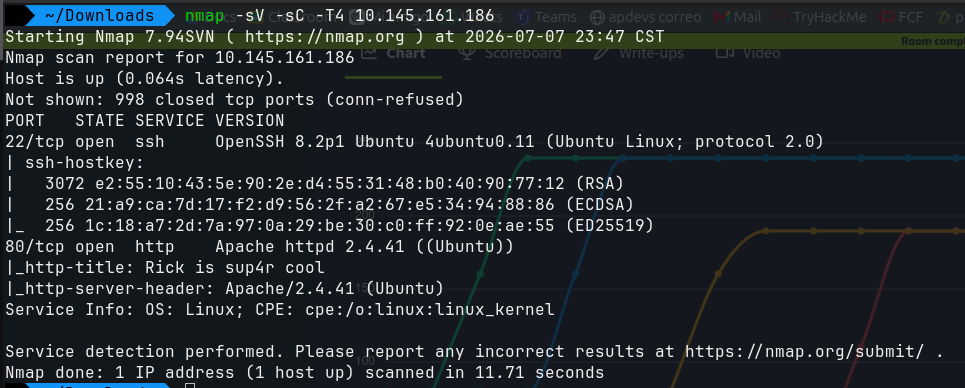
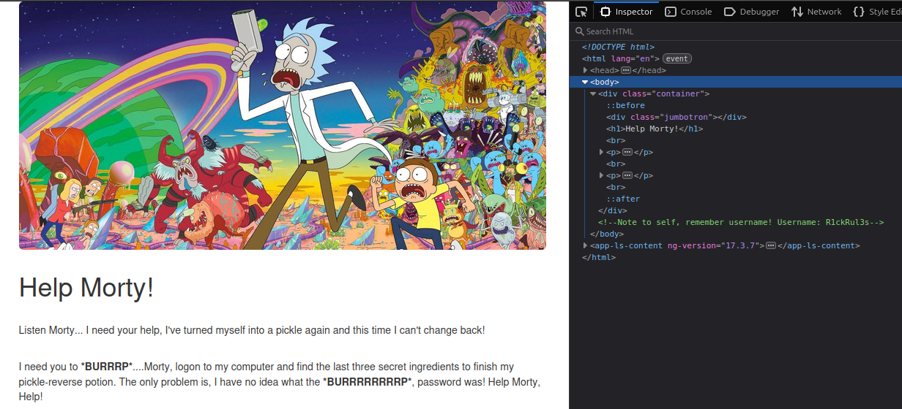
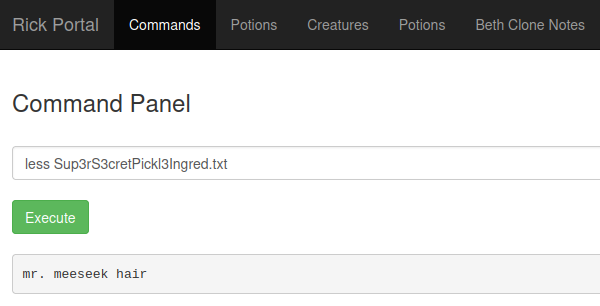

# 🥒 [Write-up] Pickle Rick - TryHackMe


## 1. Resumen Ejecutivo y Metadatos
* **Fecha:** 30/06/026
* **Plataforma:** TryHackMe
* **Categoría:** Pentesting / Linux Web Exploitation
* **Objetivo:** Conseguir los tres ingredientes secretos ocultos en el servidor para ayudar a Rick a volver a su forma humana.

---

## 2. Entorno de Trabajo y Herramientas
* **Sistema Atacante:** Kali Linux
* **Sistema Objetivo:** Ubuntu (Máquina virtual de la sala)
* **Herramientas utilizadas:** `nmap`, `gobuster` (o `dirb`), navegador web, comandos de Linux (`cat`, `ls`, `sudo`).

---

## 3. Fase de Reconocimiento y Enumeración

### Escaneo de Puertos (Nmap)
Se inició con un escaneo básico para identificar los puertos abiertos en la IP objetivo:
```bash
nmap -sV -sC -T4 <IP_OBJETIVO>
```



Se observa el resultado del escaneo con los puertos 22 y 80 abiertos

---

## 4. Fase de explotación. 

### Inspección Web.
Gracias a que encontramos que el puerto 80 está abierto podemos deducir que hay una página web en la ip destino. 
Una vez dentro de la página utilizamos la herramienta de inspeccionar la página en busca de alguna pista. 



Encontramos el usuario R1ckRul3s, ahora usaremos gobuster para encontrar otros archivos y páginas. 

```bash
gobuster dir -u http://<IP_DE_PICKLE_RICK> -w /snap/seclists/current/Discovery/Web-Content/common.txt -x php,html,txt
```
Con este comando se logran encontrar los siguientes archivos: login.php y robots.txt
Dentro del archivo robots.txt se encuentra lo que parece ser la contraseña: Wubbalubbadubdub.

Finalmente logramos acceder al portal principal donde encontramos un command panel donde podemos interactuar con el sistema linux, ejecutamos el comando `ls`  y encontramos el siguiente archivo de interés Sup3rS3cretPickl3Ingred.txt, debido a que el comando `cat` está bloqueado usaremos el comando `less` para ver el contenido del archivo. 



También se encuentra el archivo clue.txt el cual nos indica que debemos buscar el próximo ingrediente dentro del sistema. 

Buscando dentro de la dirección /home/Rick se encuentra un archivo llamado second ingredients el cual leemos con el comando `less /home/rick/"second ingredients"` obteniendo nuestro segundo ingrediente: 1 jerry tear.

Para la búsqueda del tercer ingrediente buscaremos dentro de /root `sudo ls -la /root` encontramos el archivo 3rd.txt el cual leemos con el comando `sudo less /root/3rd.txt` y finalmente obtenemos el último ingrediente fleeb juice para completar el laboratorio.

## 5. Conclusiones y Aprendizajes Clave

### Lecciones Aprendidas: 
En este laboratorio se recalca la importancia de no dejar credenciales como comentarios dentro del código ni nada que sea crítico para el funcionamiento de la aplicación ya que esa información está expuesta a cualquier usuario dentro de la web, por otro lado se demostró la importancia de gobuster para encontrar páginas expuestas y documentos dentro del servidor. Por último conocí el comando less otra forma de mostrar el contenido de un archivo de texto. 

### Retos superados: 
Durante el desarrollo del laboratorio observé que hay páginas bloqueadas ya que muestran la página denied.php que nos indica que solo el verdadero Rick puede verlas, en ese momento pensé que por medio de las cookies estaba identificando que mi usuario no es Rick, entonces al modificar dicha petición usando BurpSuite podría saltarme dicha verificación, lamentablemente esta deducción fue incorrecta y dentro del ámbito laboral sería un gasto de recursos. 

