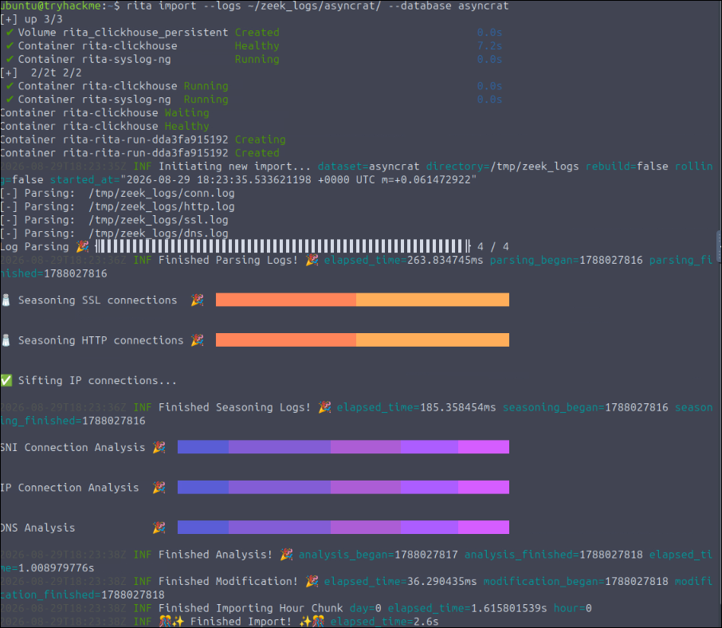
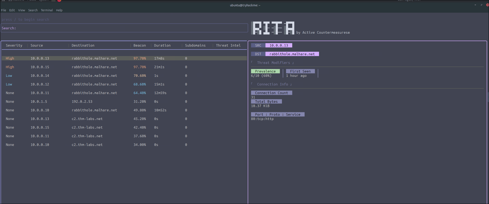
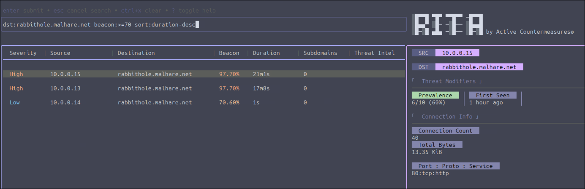

# 📡 [Write-up] C2 Detection Command & Carol - TryHackMe


## 1. Resumen Ejecutivo y Metadatos
* **Fecha:** 29/08/2026
* **Plataforma:** TryHackMe
* **Categoría:** Blue Team / Threat Hunting / Network Forensics
* **Objetivo:** Comprender la detección de canales de Comando y Control **C2** analizando tráfico de red con Zeek y RITA. 

---

## 2. Entorno de Trabajo y Herramientas
* **Sistema de Análisis:** Máquina virtual Linux (Desplegada en el laboratorio)
* **Fuentes de Datos (Datasources):** Archivos de captura de paquetes de red .pcap
* **Herramientas utilizadas:** 
  * **Zeek:** Convierte el tráfico de .pcap en logs enriquecidos.
  * **RITA:** Framework de analítica de amenazas para detectar comportamientos C2. 

---
## 3. Introducción 


### ¿Qué es Zeek? 
Es un **monitor de seguridad de red** de código abierto, cuyo objetivo principal es proporcionar visibilidad profunda y registro de actividad. 

Captura el tráfico crudo y los **traduce en logs** estructurados y tabulados. Estos logs documentan con precisión quién se comunica con quién, cuándo, cuánto duró la sesión y qué protocolos se usaron. 
Con estos logs podemos alimentar con datos limpios a un SIEM o a RITA. 


 
### ¿Qué es RITA?

RITA (Real Intelligence Threat Analytics) es un framework de código abierto que utiliza análisis estadístico para **detectar anomalías de comportamiento** como los siguientes: 
* **Beaconing:** Identifica conexiones automatizadas, por ejemplo: 
    
    Si un malware se comunica con su servidor atacante en intervalos de tiempo específicos y con tamaños de datos consistentes, RITA le asigna una puntuación de riesgo alta. 
* **Evaluación de Prevalencia:** Analiza qué tan comunes son las conexiones externas dentro de la red local, ejemplo:

    Si hay mucha comunicación de distintos equipos a una IP como Microsoft, la prevalencia será alta y marcada como normal, por otro lado si un solo equipo se comunica constantemente con una IP desconocida, RITA lo registra como altamente sospechoso.
* **Búsqueda de DNS Tunneling:** Detecta intentos de exfiltración de datos o comunicación C2 que abusan del protocolo DNS para ocultar tráfico malicioso. 

---

## 4. Metodología de Análisis y Comandos Clave
Para dar respuesta a las preguntas del laboratorio, se aplicó una metodología estructurada dividida en el tratamiento de datos y, posteriormente, Threat Hunting. 

### Paso 1: Conversión de PCAP a Logs estructurados. 
RITA no procesa el tráfico crudo, por lo que tenemos que procesar la captura con Zeek para generar logs. 
```bash
  zeek readpcap ~/pcaps/rita_challenge.pcap ~/zeek_logs/rita_challenge
```

### Paso 2: Importación a la base de datos de RITA
Una vez que ya tenemos los **logs** estructurados con `Zeek`, los vamos a importar a `RITA` para que ejecute sus algoritmos estadísticos. 

```bash
  rita import --logs ~/zeek_logs/rita_challenge/ --database rita_challenge
```



### Paso 3: Visualización e Investigación 
Para acceder a la interfaz de terminal interactiva de RITA ejecutamos:
```bash
  rita view rita_challenge
``` 

[^1]
[^1]: Como se puede apreciar se divide en 3 secciones principales: barra de búsqueda, panel de recursos y panel de detalles donde podemos ver los  `Threat Modifiers`.

---

## 5. Resolución del laboratorio. 

### 1. Analizando comportamiento de los Hosts
**Pregunta de investigación:** ¿Qué "Threat Modifier" nos dice el número de hosts que se comunican con un destino determinado?

**Respuesta: Prevalence.** (Una prevalencia baja indica que muy pocos equipos de nuestra red hablan con esa IP externa, lo que aumenta la probabilidad de que sea un canal C2 aislado).

### 2. Búsqueda con Filtro avanzado
Para encontrar al host atacante `rabbithole.malhare.net` y confirmar el comportamiento automatizado del malware (beaconing), utilizamos la barra de búsqueda de RITA combinando filtros específicos.
**Reto:** Encontrar entradas comunicándose con dicho dominio, con un beacon score mayor a 70% y ordenadas por duración descendente.

Comando aplicado:
```bash
 dst:rabbithole.malhare.net beacon:>=70 sort:duration-desc
```

[^2]
[^2]: Se observan los resultados del filtro (aquellos con un porcentaje de beacon mayor al 70%)
---

## 6. Conclusiones y aprendizaje
### Lecciones Aprendidas

Gracias a esta práctica logré adentrarme en el análisis de tráfico proactivo (Threat Hunting). Comprendí que los actores de amenazas modernos logran evadir los antivirus convencionales utilizando cifrado o herramientas legítimas (Living off the Land), pero **no pueden ocultar los patrones matemáticos del tráfico de red** (como el beaconing y las conexiones largas). Aprender a usar RITA junto con Zeek proporciona una visibilidad inmensa que será fundamental en mis operaciones de documentación y respuesta a incidentes como SOC L1.
