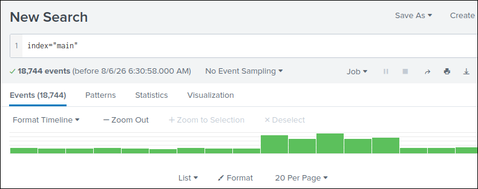
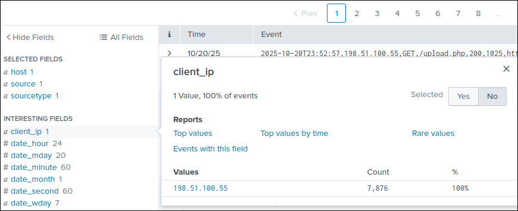
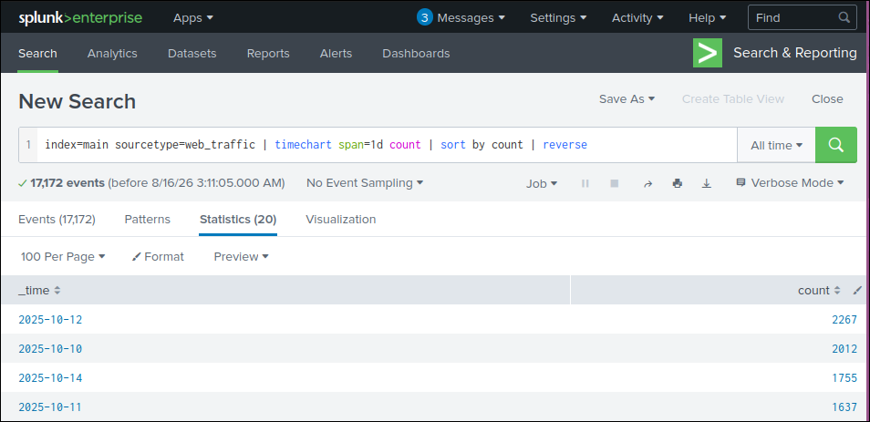

# 🔍 [Write-up] Splunk Basics - TryHackMe


## 1. Resumen Ejecutivo y Metadatos
* **Fecha:** 03/12/2025
* **Plataforma:** TryHackMe
* **Categoría:** Blue Team / SIEM / Log Analysis & Forensics
* **Objetivo:** Comprender la arquitectura fundamental de un sistema SIEM, aprender a navegar por la interfaz de Splunk y utilizar el lenguaje de búsqueda SPL para auditar eventos de seguridad y responder preguntas de investigación forense.

---

## 2. Entorno de Trabajo y Herramientas
* **Sistema de Análisis:** Instancia Web de Splunk Enterprise (Desplegada en el laboratorio)
* **Fuentes de Datos (Datasources):** Logs de servidores web (Apache/Nginx), logs de eventos de Windows, registros de red/firewall y VPN.
* **Herramientas utilizadas:** Splunk Search & Reporting App, lenguaje SPL, filtros por campos.

---

## 3. Metodología de Análisis y Sintaxis SPL

Para responder a las preguntas de investigación del laboratorio, se aplicó una metodología estructurada dividida en tres pasos clave:

### Selección e Inspección del Índice (Index)
El primer paso en Splunk consiste en especificar el conjunto de datos sobre el cual queremos trabajar mediante el parámetro `index`:
```spl
index="main"
```


### 1. Encontrando la IP del atacante

Como primer actividad sospechosa encontramos dentro de la gráfica se observan unos picos de actividad irregulares, en segundo lugar dentro de los **user_agent** hay algunos comandos inusuales como wget, curl, zgrab y sqlmap. 

Para filtrar nuestros resultados y acercarnos a nuestro atacante emplearemos la siguiente consulta excluyendo los agentes conocidos: 

```spl 
index=main sourcetype=web_traffic user_agent!=*Mozilla* user_agent!=*Chrome* user_agent!=*Safari* user_agent!=*Firefox*
``` 

Con este filtro observamos que solo nos queda una ip relacionada a toda la actividad, por ende está es la ip del atacante 



### 2. ¿Qué día hubo más tráfico de logs?

Para responder esta pregunta haremos uso del comando timechart y el parámetro span=1d para contar por cada día, nuestra consulta completa quedaría de la siguiente forma: 

`index=main sourcetype=web_traffic | timechart span=1d count | sort by count | reverse`

Hacemos uso de reverse para que aparezca como primer valor el máximo.



El día que hubo más tráfico en los logs fue el 2025-10-12.

### 3. ¿Cuál es el número de eventos de la cuenta Havij?

Para esta pregunta se ejecuta el siguiente comando donde filtrará los resultados para obtener solo los del user_agent **"Havij"** y contamos cuantos eventos han sido registrados.

`index=main sourcetype="web_traffic" user_agent="*Havij*" | stats count`

Al ejecutar encontramos que hay **993** eventos registrados con dicho agente.

### 4. ¿Cuántos bytes se han transferido desde el servidor?

`sourcetype=firewall_logs src_ip="10.10.1.5" AND dest_ip="198.51.100.55" AND action="ALLOWED" | table _time, action, protocol, src_ip, dest_ip, dest_port, reason`

[!Información comprometida](img/info_comprometida.png)

Con este comando nos muestra toda la información que ha sido enviada con éxito a la dirección del atacante, ahora solo falta sumar la cantidad de bytes para resolver la pregunta. 

`sourcetype=firewall_logs src_ip="10.10.1.5" AND dest_ip="198.51.100.55" AND action="ALLOWED" | stats sum(bytes_transferred) by src_ip`

Finalmente encontramos que fueron transferidos **126,167 bytes** de información.

## 4 Conclusiones y aprendizaje 

### Lecciones Aprendidas 
Gracias a esta práctica comencé a familiarizarme con splunk y cómo navegar sobre él para la defensa de los sistemas mediante búsquedas con el lenguaje SPL. 


